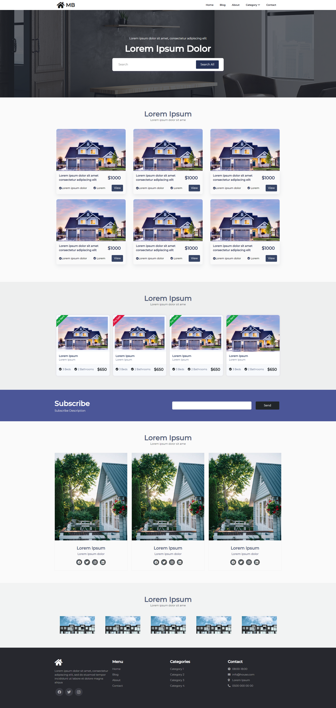

# Paris Inmobiliaria – Frontend (Firebase)

Aplicación web de catálogo de propiedades para una inmobiliaria, construida con React y Firebase (Firestore, Storage, Hosting). El proyecto fue migrado a Firebase; ignorar carpetas de backend anteriores (por ejemplo `backend/`).



## Tecnologías

- React 19 + react-router-dom 7
- Firebase JS SDK 11 (Firestore, Auth, Storage [para imágenes])
- Bootstrap 5, react-image-gallery, react-burger-menu, styled-components
- Firebase Hosting (SPA con rewrites)

## Estructura relevante

- `src/`
	- `App.js`: rutas principales
	- `components/`:
		- `Blog.js`: listado de propiedades (lee de Firestore)
		- `BlogDetail.js`: detalle de propiedad por `id`
		- `EditPropiedad.js`: edición y borrado de propiedad (admin)
		- `Login.js`: login simple para habilitar modo admin (sin Auth de Firebase)
		- `RequireAdmin.js`: protege rutas admin
	- `firebase/`:
		- `firebaseConfig.js`: inicialización (exporta `db`, `auth`)
		- `propertyService.js`: alta de propiedades en `propiedades`
		- `uploadService.js`: subida de imágenes a Storage (usa ruta `categoria/propertyId/archivo`)
- `firebase.json`: configuración de Hosting/Firestore/Storage
- `firestore.rules` y `storage.rules`: reglas de seguridad (ver sección Reglas)

Nota: `backend/` corresponde al backend anterior y debe ignorarse tras la migración a Firebase.

## Rutas principales

- `/` Home
- `/blog` Listado de propiedades (desde Firestore)
- `/blog/:id` Detalle de propiedad
- `/login` Ingreso simple para modo administrador
- `/admin` Panel de carga rápida (admin) – usa Firestore
- `/editar-propiedad/:id` Edición y borrado (admin)

La ruta `/create` es legado (apunta al backend anterior con `axios`) y se recomienda deshabilitarla o migrarla a Firebase.

## Modelos de datos (Firestore)

Colección: `propiedades`

Documento (ejemplo):

```
propiedades/{id}:
	titulo: string                 // "Casa céntrica con jardín"
	categoria: string              // enum: "casa" | "departamento" | "lote" | "local"
	operacion: string              // enum: "venta" | "alquiler"
	metros: string                 // metros totales; actualmente se guarda como texto
	localidad: string              // ubicación/libre
	observacion: string            // opcional
	images: string[]               // URLs públicas en Storage
	// Sugeridos (opcionales, aún no implementados en el UI):
	// createdAt: Timestamp
	// updatedAt: Timestamp
	// precio: number
	// ambientes: number, banios: number, cocheras: number
```

Referencias en el código:
- Alta: `src/firebase/propertyService.js` (addDoc en `propiedades`)
- Listado: `src/components/Blog.js` (getDocs de `propiedades` y filtros en cliente)
- Detalle: `src/components/BlogDetail.js` (getDoc por `id`)
- Edición/Eliminación: `src/components/EditPropiedad.js` (`updateDoc`/`deleteDoc`)

## Almacenamiento de imágenes (Firebase Storage)

- Subida prevista en `src/firebase/uploadService.js` con estructura:
	- `/<categoria>/<propertyId>/<archivo>`
- Las URLs descargables se guardan en el campo `images` del documento `propiedades/{id}`.
- Asegurarse de exportar `storage` desde `firebaseConfig.js` si se usa `uploadService` (está comentado en el repo).

## Reglas de seguridad (importante)

Actualmente, las reglas están en modo “denegar todo” para Firestore y Storage:

- `firestore.rules`
```
allow read, write: if false;
```
- `storage.rules`
```
allow read, write: if false;
```

Esto protege datos por defecto, pero bloquea la app en producción. Opciones recomendadas:

1) Desarrollo local con Emulador de Firebase (sin tocar reglas de prod).
2) Reglas mínimas para lectura pública y escritura solo admin. Ejemplo orientativo (ajustar a su Auth):

Firestore (ejemplo):
```
rules_version = '2';
service cloud.firestore {
	match /databases/{database}/documents {
		match /propiedades/{id} {
			allow read: if true; // público
			allow write: if request.auth != null && request.auth.token.admin == true;
		}
	}
}
```

Storage (ejemplo):
```
rules_version = '2';
service firebase.storage {
	match /b/{bucket}/o {
		match /{allPaths=**} {
			allow read: if true; // público
			allow write: if request.auth != null && request.auth.token.admin == true;
		}
	}
}
```

Nota: El proyecto actual no usa Firebase Auth para admin; el login es local (LocalStorage/SessionStorage). Si se aplican reglas basadas en `request.auth`, será necesario integrar Auth y (opcionalmente) custom claims de admin.

## Flujo de alta/edición

1. Ingresar en `/login` con credenciales definidas en `Login.js` (modo admin local).
2. Ir a `/admin` y completar: `titulo`, `categoria`, `operacion`, `metros`, `localidad`, `observacion`.
3. Se crea un documento en `propiedades` (por ahora sin imágenes).
4. Para editar o borrar: `/editar-propiedad/:id`.
5. Para ver el detalle: `/blog/:id`.

Imágenes: el servicio `uploadService.js` define la subida a Storage y retorna URLs; integrar su uso en el formulario si se desea adjuntar imágenes al alta/edición.

## Configuración y ejecución

Requisitos:
- Node.js 18+ (recomendado LTS)
- Firebase CLI (para deploy y emuladores)

Scripts (npm):
- `npm start` – Dev server
- `npm run build` – Compilación para producción
- `npm test` – Tests de Create React App

Hosting (Firebase):
1. `npm run build`
2. `firebase deploy` (usa `public: (build)` y rewrites SPA)

## Notas y pendientes

- Deshabilitar o migrar la ruta legacy `/create` (usa `REACT_APP_BACKEND_URL`).
- Exportar `storage` en `firebaseConfig.js` si se activará carga de imágenes.
- Considerar integrar Firebase Auth + claims de admin para seguridad real en Firestore/Storage.
- Opcional: agregar `createdAt/updatedAt` con `serverTimestamp()` y/o índices si se consultara con filtros en servidor.

## Licencia

Uso interno del proyecto de la inmobiliaria; ver licencias de dependencias según `package.json`.